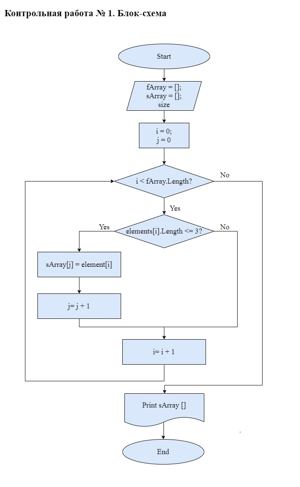

## Блок-схема решения задачи

## Текстовое описание
1. Создаем два массива - начальный и новый. Длину конечного (второго) массива объявляем совпадающей с длиной начального массива.
2. Создаем условие, при котором в конечный массив будут заноситься только те элементы из начального массива, длина которых не превышает 3 символа.
3. Если элемент [i] из первого массива удовлетворяет условию, объявленному в п.2, то элемент [i] из первого массива заносится в элемент [j] второго массива.
4. Если условие не выполняется, индекс первого массива увеличивается на 1, условие проверяется повторно.
5. Перебираем начальный массив до конца и формируем конечный массив.